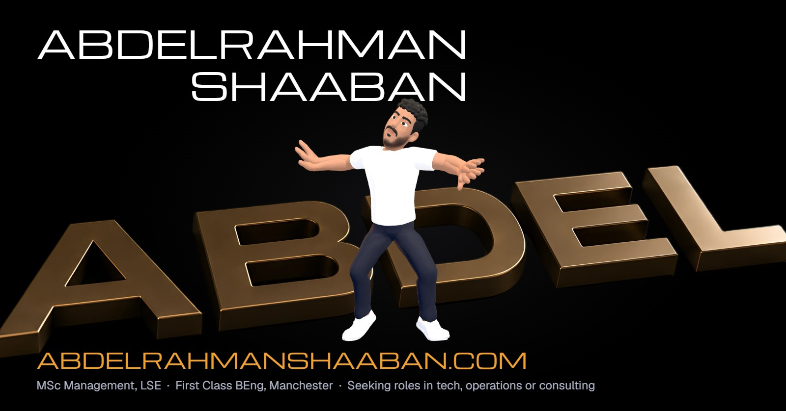

<h2 align="center"><a href="https://abdelrahmanshaaban.com">abdelrahmanshaaban.com</a></h2>

Everything about me in one place: what I have built, where I have been, and how to reach me. 
It is a place you walk through.

<a href="https://abdelrahmanshaaban.com"><b>Open the site&nbsp;&rarr;</b></a>
&nbsp;·&nbsp;
<a href="https://www.linkedin.com/in/abdelrahman-shaaban1">LinkedIn</a>
&nbsp;·&nbsp;
<a href="https://www.instagram.com/shaaban__ai/">@shaaban__ai</a>
&nbsp;·&nbsp;
<a href="mailto:shaaban721@outlook.com">shaaban721@outlook.com</a>

---

I build things that run in a browser tab and try to feel like more than a browser tab.
Real-time WebGL, procedural geometry, and live data, usually with no build step at all.

MSc Management at LSE. First Class BEng in Mechanical Engineering with Management from Manchester.
Looking for graduate roles in tech, operations or consulting.

---

### 🌸 [Spring Bloom](https://github.com/amrbody71-commits/spring-bloom)

A published children's book as a 3D pop-up you can read in a browser. The hardback lies on
a desk under a lamp, every page turn bends like paper, and when a spread settles its
illustration stands up off the page as layered cut-outs while a narrator reads it with each
word lit as it is spoken. Tap a word and it is said on its own. Tap the fox and the camera
flies to the fox.

The cut-outs are segmented from the printed illustrations, so every picture on screen is the
book's own. Built with the permission of the authors Sadia Mir and Summer Al-Jarrah Bateiha,
the illustrator Inna Ogando and Hamad Bin Khalifa University Press.

`three.js` · `WebGL` · `ElevenLabs` word timings · `SAM2` cut-outs · no build step

**[Live →](https://spring-bloom-phi.vercel.app)**

---

### 🌍 [Our Beautiful Planet](https://github.com/amrbody71-commits/our-beautiful-planet)

A spinning Earth carrying **284 live webcams across 53 countries**. Hover a pin and you see
what is happening there right now. The globe is lit from the real subsolar point, so the
cameras that are genuinely in darkness read as dark. That is the whole idea.

Geographic correctness is asserted against the *real Earth*, after a mirrored-world bug once
stayed perfectly self-consistent through every internal check.

`WebGL2` · `three.js` · `GLSL` · `Natural Earth` · `NASA Black Marble` · no build step

**[Live →](https://our-beautiful-planet.vercel.app)**

---

### 𓂀 [DUAT](https://github.com/amrbody71-commits/duat)

A scroll-driven descent into the Egyptian underworld. The sun sets over Giza, you fall
through the bedrock into the Hall of Two Truths where your heart is weighed against a
feather, and you climb back out at dawn.

The pyramids, dunes, sky, river, hall and the extruded `DUAT` wordmark are **all procedural
geometry**, written in code. One HTML file, no bundler, no `node_modules`.

My first website.

`three.js` · `GLSL` · `procedural geometry` · `ACES filmic` · single file

**[Live →](https://duat-phi.vercel.app)**

---

### عُمر [OMR](https://github.com/amrbody71-commits/omr)

A scroll-driven descent through a life. Photographs hang as glass lanterns on a helix
falling away into the dark, a thread of light runs down the axis lit only as far as you
have travelled, and the colour of the world shifts as you pass through the years.

Volumetric ink boils off the thread: a `GPUComputationRenderer` FBO pair advecting up to
**36,864 particles entirely on the GPU**, each one keeping the colour of the year it was
born into.

The album is a private family one, so the photographs stay private and the repository
publishes **the engine and the pipeline**. It ships with a placeholder album so a clone still runs.

`three.js` · `GPGPU` · `GLSL` · `fal` depth pipeline

---

### ✋ [Casing](https://github.com/amrbody71-commits/casing)

Control time with your hand. A webcam tracks one hand, and the gap between your thumb and
index finger scrubs through a sequence of frames. Open your hand and the Great Pyramid goes
up block by block while the date counts from 2580 to 2560 BCE. Close it and the plateau is
bare desert again.

This only works if every frame sits further along than the one before it, so each clip is
scored before it ships. Six of seven stock flower timelapses failed, and so did the raw
Dubai satellite series until its frames were normalised.

`WebGL2` · `MediaPipe` · `GLSL` · hand tracking in a worker · no build step

**[Live →](https://casing.vercel.app)**

---

### 📡 [Empty Skies](https://github.com/amrbody71-commits/empty-skies)

An animated reconstruction of the Middle East airspace shutdown, 27 February to 3 March 2026:
about **13,000 modelled flights across 120 hours**, on a globe or a flat map. Iran, Iraq,
Kuwait and the UAE close, traffic falls 89%, and 441 aircraft already in the air turn for the
nearest open field.

OpenSky's REST API only reaches back an hour, so the traffic is modelled, and the page says so
on screen the whole time. A script swaps in real OpenSky data and the badge turns green by
itself.

The live link opens the second version, a 3D console of real aircraft that needs no API keys.
It had **about 500 visitors** by September 2026.

`Canvas 2D` · `Natural Earth` · `OpenSky` · `Python` · single HTML file

**[Live →](https://empty-skies.vercel.app)**

---

### 🕰️ [Timeport](https://github.com/amrbody71-commits/timeport)

Stand somewhere that no longer exists. Manchester 1750, Times Square 1910, Alexandria 1970,
as 360° panoramas you look around from the inside.

An equirectangular image has to wrap, and diffusion models do not know that. The seam is
fixed by rolling the image 50% so the tear lands mid-frame where an inpaint can reach it,
repairing it with the **same** 360 LoRA still loaded, then rolling back. Repair it with the
base model instead and that strip quietly reverts to normal perspective.

`FLUX` · `LoRA` · `fal` · period-researched prompts

---

### 👔 [style.](https://github.com/amrbody71-commits/style)

I photographed every piece of clothing I own, and now something builds me an outfit before
I wake up. It reads the weather, assembles looks from the actual clothes, and renders one
self-contained page with the garments cut out and embedded. It has **20 users** as of
September 2026.

Feedback becomes dated one-line rules like *always a white tee under any quarter-zip*, capped
at twenty lines so the rulebook stays short.

The engine and schema are public, and the wardrobe stays private.

`Python` · `Pillow` · weather-reactive · learns from feedback

---

### 🧾 [Receipt Roll](https://github.com/amrbody71-commits/receipt-roll)

Receipt photos in, a ledger out. A vision model read every figure off each photograph, from
the shop and the date to the items and the total. The page turns that into a ledger you can
filter, with charts and a flag on any receipt over an amount you choose.

The demo runs on receipt photos downloaded from the internet, dated 2012 to 2019. Swap in
your own by replacing the data block at the top of the file.

`vision model` · built with `Claude Code` · one HTML file · no backend

**[Live →](https://receipt-roll.vercel.app)**

---

### ✈️ [Airplane Notifier](https://github.com/amrbody71-commits/airplane-notifier)

A Windows tray app. Five minutes before a meeting, an airplane flies across every monitor
towing a banner with the meeting's name. On its own schedule, a character walks in from a
corner of the screen to ask whether you have eaten or had water, then walks back out.

Event titles are drawn as plain text. Qt detects rich text by default, so a calendar invite
whose title held an `` tag pointing at a network share would make Qt open a connection
and leak a Windows credential hash.

`Python` · `PyQt6` · `Google Calendar API` · 233 tests

---

### Also built, still private

| | |
|---|---|
| **Jumu'ah Manchester** | Prayer times, for people who need them |

---

Most repositories here are working notebooks, and the public ones spell out what they
do not do. The globe's README has a *Known gaps* section for a reason.
